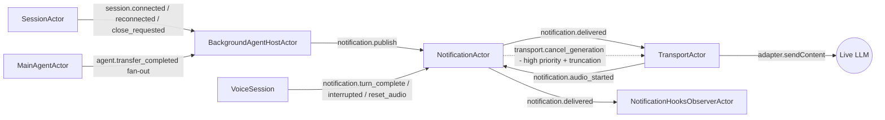

# Background Agents

A **`BackgroundAgent`** is an always-on, user-defined producer that injects synthetic user turns into the live LLM in actor mode. Use it for wall-clock reminders, external-channel alerts, polling for changes in another system — anything that should be spoken by the live agent without being invoked by a tool call.

This page covers what background agents are, how their lifecycle works, how to publish notifications, and how to wire one into a `VoiceSession`. The full design is in [`design-background-notification-actor.md`](../../dev_docs/framework/design-background-notification-actor.md).

## How they differ from subagents

| | Subagent | BackgroundAgent |
|---|---|---|
| Trigger | Spawned per tool call (or reused as `persistent_session`) | Started once on `session.connected` |
| Engine | Vercel AI SDK `generateText` loop | User-defined class — can use any timer/IO/poll loop |
| Output path | Tool result protocol (or `[SYSTEM: …]` notification) | `notification.publish` → `NotificationActor` → `[label]: text` synthetic turn |
| Driven by | The live LLM (via tool call) | The agent itself (wall clock, external event, etc.) |

## Lifecycle

`BackgroundAgentHostActor` drives the lifecycle from session events:

| Hook | When it fires | Notes |
|---|---|---|
| `onStart(ctx)` | First `session.connected` envelope (only when `prevPhase ∈ {created, connecting}`) | Fires **exactly once** per session — deferred until the live transport is ready |
| `onAgentTransfer({fromAgent, toAgent})` | After every `agent.transfer_completed` | Always invoked, regardless of `cancelOnTransfer` |
| `onReconnect()` | After every `session.reconnected` | Optional — implement only if you need to resync external state |
| `onStop(reason)` | `session.close_requested` / `transport.closed`, or after `agent.transfer_completed` when `cancelOnTransfer === true` | Always invoked once before the agent is discarded |

If `cancelOnTransfer === true`, the supervisor aborts `ctx.signal` and calls `onStop('transfer')` after `onAgentTransfer`. Default is `false` — reminder-style producers usually survive transfer; flow-specific producers opt in.

Throws inside any hook are caught by the supervisor and logged. A misbehaving agent does not bring down the session — the supervision policy for the notification subsystem is `'resume'`.

## Publishing notifications

`ctx.publish(notification)` is the only way to inject a synthetic user turn. The shape:

```ts
ctx.publish({
  label: 'TIME REMINDER',                  // wrapped as `[TIME REMINDER]: ...` on the wire
  text: 'About 25 minutes remain ...',
  priority: 'high',                        // 'normal' (default) or 'high'
  turnComplete: true,                      // default true; pass false to keep accumulating
  dedupKey: 'time-reminder',               // latest-wins replacement on duplicates
  correlationId: 'optional-trace-id',      // forwarded as envelope correlationId
});
```

Behavior decided by `NotificationActor`:

- **Normal priority + idle:** delivered immediately as a synthetic user turn.
- **Normal priority + model busy:** queued; flushed at `notification.turn_complete`.
- **High priority + idle:** delivered immediately.
- **High priority + model busy + truncation-capable transport:** the actor sends `transport.cancel_generation` first (cancel-and-deliver), then delivers the notification.
- **High priority + model busy + non-truncating transport:** queued at the head of the queue (`unshift`).
- **Dedup:** if `dedupKey` matches a pending entry, the new one replaces it. Dedup runs **before** the priority/audio branch.

`label` is normalized on ingest: uppercased, sanitized to `[A-Z0-9 _-]`, capped at 32 chars, and falls back to `'SYSTEM'` if empty. The wire format is always `[NORMALIZED LABEL]: text`.

## Configuration

Pass background agents into `VoiceSessionConfig` when you create the session. Actor mode is required.

```ts
import { VoiceSession } from '../../src/core/voice-session.js';
import { TimingReminderBackgroundAgent } from './lib/timing-reminder-agent.js';

const session = new VoiceSession({
  sessionId: 'session_1',
  userId: 'user_1',
  apiKey: process.env.GEMINI_API_KEY!,
  agents: [interviewerAgent],
  initialAgent: 'interviewer',
  port: 9900,
  model: google('gemini-2.5-flash'),
  orchestrationMode: 'actor',                          // required
  backgroundAgents: [new TimingReminderBackgroundAgent(state)],
  hooks: {
    onBackgroundNotification: (e) => {
      console.log(
        `[notify] ${e.label} priority=${e.priority} deferredMs=${e.deferredMs}`,
      );
    },
  },
});
```

`onBackgroundNotification` is opt-in. The framework constructs `NotificationHooksObserverActor` only when a handler is provided, so there is zero overhead otherwise. The event includes `sessionId`, `id`, `label`, `priority`, `publishedAtMs`, `deliveredAtMs`, `deferredMs`, and `correlationId`.

## Example: a wall-clock reminder

`examples/interviewer/lib/timing-reminder-agent.ts` ships a working `BackgroundAgent` that nudges the LLM every 5 minutes with the remaining time:

```ts
export class TimingReminderBackgroundAgent implements BackgroundAgent {
  readonly name = 'timing-reminder';
  readonly cancelOnTransfer = false;     // time-remaining survives interviewer → recruiter handoff

  onStart(ctx: BackgroundAgentContext): void {
    const startedAt = Date.now();

    let handle: ReturnType<typeof setInterval> | null = null;
    const stop = (reason: string) => {
      if (handle !== null) {
        clearInterval(handle);
        handle = null;
        ctx.log(`stopped: ${reason}`);
      }
    };

    const tick = () => {
      if (this.state.phase === 'completed') return stop('interview phase=completed');

      const elapsedMs = Date.now() - startedAt;
      const remainingMin = Math.max(0, Math.round((this.totalBudgetMs - elapsedMs) / 60_000));
      if (remainingMin <= 0) return stop('budget elapsed');

      ctx.publish({
        label: 'TIME REMINDER',
        text:
          `Wall-clock checkpoint: about ${remainingMin} minute(s) remain in this interview. ` +
          'Briefly remind the candidate of the time remaining in one short sentence, ' +
          'then return to the active interview question.',
        priority: 'high',
        dedupKey: 'time-reminder',
      });
    };

    handle = setInterval(tick, this.intervalMs);
    ctx.signal.addEventListener('abort', () => stop('signal aborted'));
  }
}
```

Key patterns to mirror in your own agents:

- **Always wire `ctx.signal.addEventListener('abort', ...)` to clear timers and IO.** The signal aborts on session close and on transfer when `cancelOnTransfer` is true.
- **Use `dedupKey` for periodic producers.** A stale "30 minutes left" should never follow "20 minutes left" out of order.
- **Stop on terminal conditions inside your tick.** Don't keep ticking past the natural end of the work — pin the event loop only while the work is live.

## Where this lives in the actor graph



The TTS-aware lifecycle ticks (`turn_complete`, `interrupted`, `reset_audio`) come from `VoiceSession` rather than the raw transport callback so notifications wait for **TTS audio completion** rather than just LLM generation. See [Actor Runtime Pattern → TTS-aware turn boundary](/guide/actor-pattern#message-flow-high-level).

## Related docs

- [Actor Runtime Pattern](/guide/actor-pattern) — the full actor graph and notification subsystem zoom-in
- [Subagent Patterns](/advanced/subagents) — for tool-driven (rather than always-on) producers
- [Persistent Subagent Lifecycle](/advanced/persistent-subagent-lifecycle) — long-running tool subagents
- [Investigation: background notifications status quo](../../dev_docs/framework/investigation-background-agent-status-quo.md)
- [Design: NotificationActor + BackgroundAgent](../../dev_docs/framework/design-background-notification-actor.md)
- [API: `BackgroundAgent`](/api/interfaces/BackgroundAgent)
- [API: `BackgroundAgentContext`](/api/interfaces/BackgroundAgentContext)
- [API: `PublishNotification`](/api/interfaces/PublishNotification)
