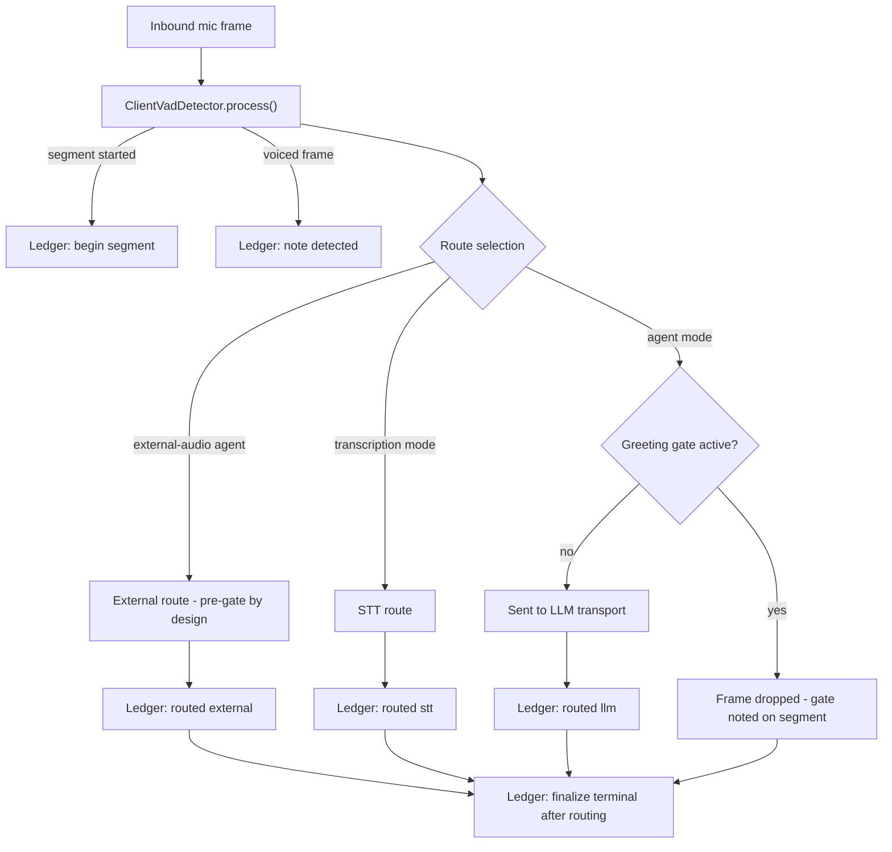
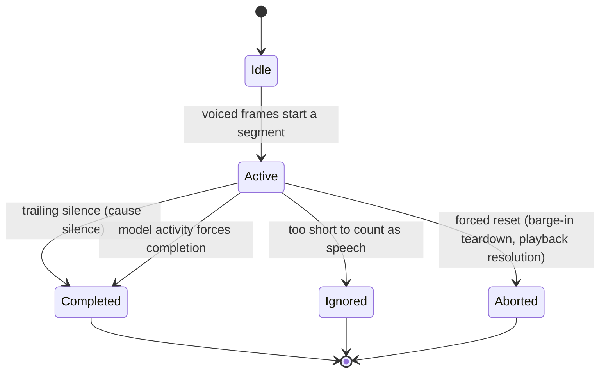

# Speech Evidence Model

The framework distinguishes three claims about user speech that are easy to
conflate — and that, when conflated, produce subtle bugs:

| Claim | Meaning | Who establishes it |
| --- | --- | --- |
| **Detected** | The framework's client-audio VAD saw voiced frames | `ClientVadDetector` |
| **Routed** (delivered) | Those frames were admitted onto a route and actually left the framework | `AudioRouter` |
| **Recognized** | The provider observably received/understood the speech | Provider evidence events (transport-specific) |

Detected speech is not necessarily routed: the
[greeting gate](/guide/greeting-control) drops mic frames while suppression is
active, and transcription mode diverts frames away from the LLM. Routed speech
is not necessarily recognized: a WebSocket can drop mid-utterance, and most
providers offer no delivery acknowledgment at all.

The classic failure mode this model prevents: user speech during an
uninterruptible greeting was *detected* by the VAD, *dropped* by the gate — and
then a response watchdog armed anyway, because arming keyed off detection
instead of delivery. The watchdog fired, reconnected the transport, nudged the
model, and the user heard the greeting twice.

## Per-frame pipeline

Every inbound mic frame flows through a fixed order: VAD classification first,
then a single routing decision, then evidence finalization.

Two rules in this pipeline carry most of the weight:

- **The gate is read exactly once per frame.** That single read decides the
  drop, the routed-bit update, and the gate-at-segment-start diagnostic. Two
  reads could disagree at a grace-expiry boundary.
- **Only the LLM route consults the gate.** External-audio agents (for
  example, a Twilio bridge feeding a phone-side agent) consume mic frames
  pre-gate by design, and STT routes are diverted before the gate.

## Segment lifecycle

The VAD groups voiced frames into segments. Each segment resolves to exactly
one terminal outcome, with a recorded cause:

The terminal record travels on two tracks. Legacy `VadEvents` fire
synchronously inside `process()` (existing consumers depend on that ordering),
while the evidence ledger receives the terminal descriptor only **after** the
terminal frame finished routing — so the ledger's routed bits are complete by
the time any policy reads them.

## The ledger

`UserTurnEvidenceLedger` keeps one evidence record per VAD segment: an active
slot plus a small ring of recent terminals. Each record captures:

- voiced-frame counts and timing (first/last voiced, resolved-at),
- which routes admitted speech (`llm` / `stt` / `external`),
- whether the greeting gate was active at segment start,
- the terminal outcome and cause,
- provider evidence, where the transport can supply it.

Provider recognition is deliberately **tri-state**: `observed`,
`not-observable` (the transport declares no such capability — the common
case), or `unknown` (capability declared, evidence absent). Policies must
never treat "no acknowledgment" as "not delivered" on a transport that cannot
acknowledge anything.

## Who consumes evidence

Downstream decisions read the ledger instead of re-deriving facts from raw VAD
state. The decision logic itself lives in small pure modules under
`src/core/policies/`:

| Policy | Decision |
| --- | --- |
| `watchdog-arm.policy` | Arm the response watchdog only for turns with speech routed to the LLM |
| `retention.policy` | Retain the utterance for stall-recovery replay only when it was routed and completed by silence |
| `barge-in.policy` | Classify a VAD segment as barge-in against current playback state |
| `greeting-gate.policy` | Bind greeting suppression to the greeting turn and decide release |
| `recovery.policy` | Defer, hold, or run watchdog recovery based on live speech and gate state |
| `finalization.policy` | Choose the turn-completion path (TTS gate, native gate, immediate) |

Each policy is a pure function (or small state machine) from evidence facts to
a verdict — testable in isolation, with the session reduced to actuating
verdicts.

## Related

- [Greeting Control](/guide/greeting-control) — the gate that makes
  detected-but-not-routed speech a normal, expected state.
- [Response Watchdog & Stall Recovery](/advanced/watchdog-recovery) — the main
  evidence consumer.
