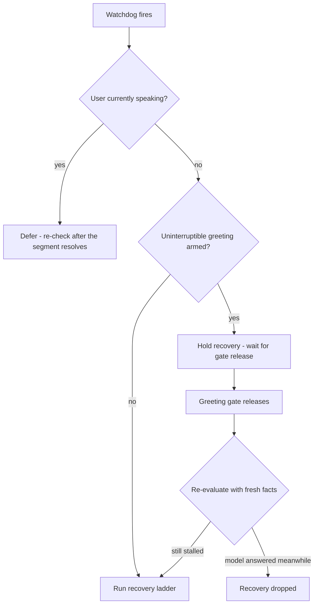
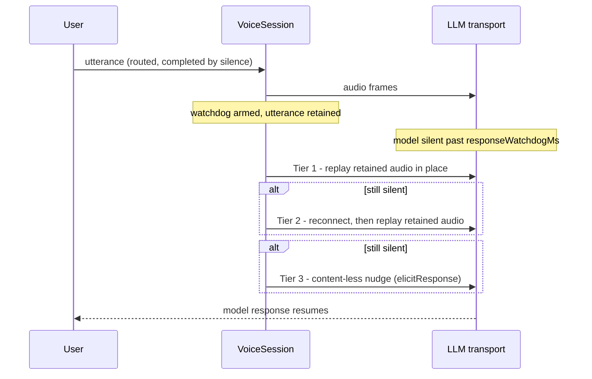

# Response Watchdog & Stall Recovery

A realtime session can stall silently: the user finishes speaking, the
provider connection is half-open or the model simply never responds, and
nothing in the protocol says so. The response watchdog bounds that silence.

```ts
const session = new VoiceSession({
  // ...
  responseWatchdogMs: 5000,        // default 5000; <= 0 disables
  watchdogReplayRecovery: true,    // opt-in replay ladder (default false)
});
```

## Arming: evidence, not detection

The watchdog arms when a user turn completes **with speech that was actually
routed to the LLM** — a fact read from the
[speech evidence ledger](/advanced/speech-evidence), not from raw VAD state.
Speech the greeting gate dropped, speech diverted to transcription, and
segments too short to count never arm it. Agent mode only: dictation and
transcription turns are never watched.

This distinction is load-bearing. Arming on *detected* speech once produced a
double greeting: speech dropped by the greeting gate armed the watchdog, the
model (correctly) stayed silent, the watchdog "recovered" a session that was
never stalled, and the reconnect nudge replayed the greeting.

## When it fires

Firing is a decision, not a reflex:



The **hold** branch protects the greeting: a watchdog firing mid-greeting must
not tear down the transport while the greeting is still playing. The held
recovery keeps its sealed candidate (the retained utterance) through the
greeting's own model-turn start, then re-evaluates once the gate releases —
recovering only if the stall is still real. Holds apply only to full-greeting
suppression, never to the short AEC grace window.

## The recovery ladder

With `watchdogReplayRecovery` enabled, the last routed user utterance is
retained (bounded, memory-only) and recovery escalates through three tiers:



- **Tier 1 — in-place replay.** The retained utterance is re-sent on the live
  connection; cheapest, no session disruption.
- **Tier 2 — reconnect + replay.** The transport reconnects (session
  resumption where supported), then replays the utterance.
- **Tier 3 — content-less nudge.** A generation trigger with no new content
  (the transport's `elicitResponse` where available). Best-effort.

Without `watchdogReplayRecovery`, recovery is reconnect + nudge only — there
is no retained audio to replay. The flag ships dark by default until
live-validated for a deployment.

## Replay freshness

Replaying a stale utterance is worse than not replaying: the model answers a
question the user already moved past. Two rules bound staleness:

- **Answered speech is not a candidate.** A model turn starting normally
  clears the retained utterance (except while a recovery is held during a
  greeting — the greeting's own turn must not consume the candidate).
- **Drained speech invalidates older candidates.** During a reconnect, mic
  audio keeps buffering and is drained to the new connection. If that drain
  contained admitted voiced audio, any retained utterance sealed *before* the
  drain is stale — the model has newer speech from the user — and is skipped
  at both replay tiers.

## Reconnect drains and the greeting gate

Mic frames buffered across a reconnect are admission-tagged **at capture
time**: each buffered frame records whether the greeting gate was active when
it arrived. On drain, gate-captured frames are discarded and admitted frames
are sent through the same resample/encode path as live audio. Deciding
admission at capture rather than at drain closes a race — a gate that released
mid-reconnect must not retroactively admit speech it had already suppressed
(nor vice versa). The same drain logic covers transport reconnects, provider
`GOAWAY` handoffs, and agent transfers.

## Tuning

| Config | Default | Notes |
| --- | --- | --- |
| `responseWatchdogMs` | 5000 | Model-silence budget after a user turn. `<= 0` disables the watchdog entirely. |
| `watchdogReplayRecovery` | `false` | Opt-in retained-utterance replay (tiers 1–2). Off = reconnect + nudge only. |

Set `responseWatchdogMs` comfortably above your provider's real first-token
latency for long answers; a watchdog that fires on a slow-but-healthy response
costs a reconnect for nothing.

## Related

- [Speech Evidence Model](/advanced/speech-evidence) — the facts arming and
  retention are decided from.
- [Greeting Control](/guide/greeting-control) — the suppression gate the hold
  branch protects.
- [Transport](/guide/transport) — reconnect and session-resumption behavior.
