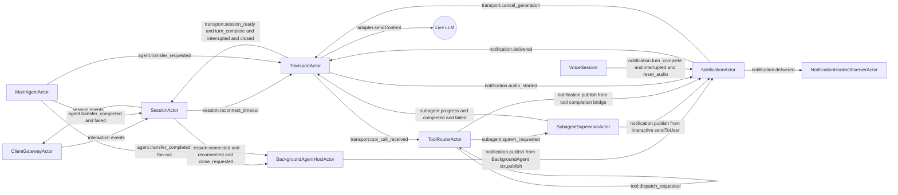
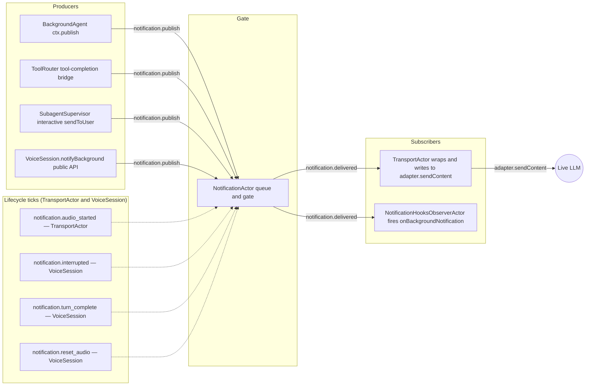

# Actor Runtime Pattern

The framework has two orchestration modes:

- `legacy`: classic router-based flow
- `actor`: message-driven actor runtime

This page explains the actor model used when `orchestrationMode: 'actor'`.

## Why actor mode exists

Actor mode makes control flow explicit and deterministic for complex sessions (tools, subagents, reconnection, and transfers) by using:

- isolated actor state
- message-only coordination
- per-actor serialized mailboxes
- supervision policies for failures

Audio still uses a direct fast-path and does not go through actor mailboxes.

## Core pieces

The runtime is centered on:

- `ActorRuntime` (`src/runtime/actor-runtime.ts`)
- `RuntimeOrchestrator` (`src/runtime/runtime-orchestrator.ts`)
- runtime message contracts (`src/runtime/messages.ts`)

Main actors:

- `SessionActor`: session phase + reconnect timing
- `TransportActor`: transport IO bridge
- `ToolRouterActor`: tool dispatch (inline/background/transfer)
- `SubagentSupervisorActor`: background workflow lifecycle
- `MainAgentActor`: agent transfer lifecycle hooks
- `ClientGatewayActor`: client message bridge

Notification subsystem (implemented — see [Background Agents](/advanced/background-agents) for usage and [design-background-notification-actor.md](../../dev_docs/framework/design-background-notification-actor.md) for the full design):

- `NotificationActor`: owns the **background notification queue** as a first-class actor — handles `notification.publish`, priority + audio-received + turn-complete gating, dedup, label normalization, and pub/sub fan-out to subscribers. Replaces the in-process `BackgroundNotificationQueue` in actor mode.
- `BackgroundAgentHostActor`: hosts user-defined `BackgroundAgent` instances (always-on producers — wall-clock reminders, polling, external alerts). Drives their `onStart` / `onAgentTransfer` / `onReconnect` / `onStop` lifecycle from session events.
- `NotificationHooksObserverActor` (opt-in): a built-in subscriber that fires `FrameworkHooks.onBackgroundNotification` for parity with `onToolCall`, `onAgentTransfer`, etc. Constructed only when a hook handler is configured.

## Actor invariants

1. One actor processes one message at a time.
2. Actor state is private; no cross-actor mutation.
3. Coordination happens through envelopes/messages only.
4. Timeouts are modeled as messages (`*.timeout`).
5. Failures are handled via supervisor policy (`restart`, `resume`, `stop`, `escalate`).

## Message flow (high level)

The full actor graph, including `NotificationActor` / `BackgroundAgentHostActor` / `NotificationHooksObserverActor` (the latter two are constructed only when the application configures `backgroundAgents` or `onBackgroundNotification`).



> **TTS-aware turn boundary.** `notification.turn_complete`, `notification.interrupted`, and `notification.reset_audio` are sent by `VoiceSession.handleTurnCompleteInternal` / `handleInterrupted` — the **effective** turn boundary that already gates on TTS audio completion via `ttsMaybeCompleteTurn`. They are deliberately **not** mirrored from `TransportActor`'s raw `adapter.onTurnComplete` callback, which fires when the LLM finishes generating, before the TTS provider has flushed its audio. This guarantees notifications wait for the user-perceived end of the model's reply.

Typical paths:

- **Inline tool:** `transport.tool_call_received` → `tool.inline.completed` → `transport.send_tool_result`.
- **Background tool:** `transport.tool_call_received` → `subagent.spawn_requested` → `subagent.completed` → `transport.send_tool_result` plus a `notification.publish` (label `'SYSTEM'`) so the model speaks a follow-up at the next idle boundary.
- **Agent transfer:** `agent.transfer_requested` → `transport.transfer_session` → `agent.transfer_completed`.
- **External producer (wall-clock reminder, alert):** `BackgroundAgent.ctx.publish` → `notification.publish` → queue/gate inside `NotificationActor` → `notification.delivered` → `TransportActor` wraps as `[label]: text` and calls `adapter.sendContent`. On truncation-capable transports a `priority: 'high'` envelope mid-turn also emits `transport.cancel_generation` first (cancel-and-deliver).
- **Interactive subagent question:** `SubagentSession.sendToUser({ blocking: true })` → `notification.publish` with `label: 'SUBAGENT QUESTION'`, `priority: 'high'` → same delivery path as above.

### Notification subsystem (zoom-in)

For illustration, here's the same notification path isolated from the rest of the actor graph. Producers fan in on the left; `NotificationActor` does the priority + audio-received + turn-complete gating in the middle; subscribers fan out on the right.



The four producer rows on the left are the **only** sources of `notification.publish` in actor mode. The four lifecycle ticks are the **only** way `NotificationActor` learns about the model's turn state (audio chunks themselves never enter the mailbox — see "Audio fast-path bridge" in the design doc). Three of those ticks (`turn_complete`, `interrupted`, `reset_audio`) are owned by `VoiceSession`'s effective turn boundary so TTS gating is honored; only `audio_started` comes directly from `TransportActor`. Fan-out is one envelope per matching subscriber, so adding observability or a label-filtered consumer is a `notification.subscribe` away.

See [design-background-notification-actor.md](../../dev_docs/framework/design-background-notification-actor.md) for the full notification message contracts, lifecycle ownership matrix, and step-by-step implementation plan.

## How to enable actor mode

Use `orchestrationMode: 'actor'` in `VoiceSession` config:

```ts
import { VoiceSession } from '../../src/core/voice-session.js';

const session = new VoiceSession({
  sessionId: 'session_1',
  userId: 'user_1',
  apiKey: process.env.GEMINI_API_KEY!,
  agents: [mainAgent],
  initialAgent: 'main',
  port: 9900,
  model: google('gemini-2.5-flash'),
  orchestrationMode: 'actor',
});
```

Notes:

- `ttsProvider` support requires actor mode.
- Legacy mode remains available for compatibility.

## When to use actor mode

Prefer actor mode when you need:

- persistent subagent lifecycle control
- strict timeout/retry/message ordering
- richer observability of runtime internals
- stronger fault isolation between orchestration components
- wall-clock or event-driven background producers via `BackgroundAgent` (periodic reminders, DB-poll alerts, external-channel nudges) — they inject synthetic user turns into the live LLM without holding a `VoiceSession` reference. See [Background Agents](/advanced/background-agents).

Use legacy mode only if you need minimal migration risk for older flows.

## Related docs

- [Background Agents](/advanced/background-agents) — implementing always-on producers (reminders, polls, alerts) with the BackgroundAgent interface
- [Subagent Patterns](/advanced/subagents)
- [Persistent Subagent Lifecycle](/advanced/persistent-subagent-lifecycle)
- [API: ActorRuntime](/api/classes/ActorRuntime)
- [API: RuntimeOrchestrator](/api/classes/RuntimeOrchestrator)
- [Investigation: background notifications status quo](../../dev_docs/framework/investigation-background-agent-status-quo.md) — emitters, abstractions, original gaps that motivated `NotificationActor`.
- [Design: `NotificationActor` + `BackgroundAgent`](../../dev_docs/framework/design-background-notification-actor.md) — message contracts, lifecycle ownership matrix, full implementation plan.
