# Architecture Overview

This page maps how all core concepts relate to each other. Use it as a mental model for understanding how data and control flow through the framework.

## The Big Picture

Every component lives inside `VoiceSession`. Two WebSocket connections bridge the client and LLM provider, with the framework orchestrating everything in between. The `LLMTransport` interface abstracts provider differences — Gemini Live and OpenAI Realtime are both supported.

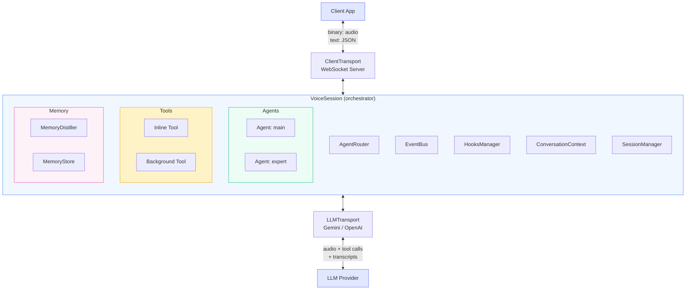

## Component Ownership

`VoiceSession` creates and manages every other component. Here's the ownership tree:

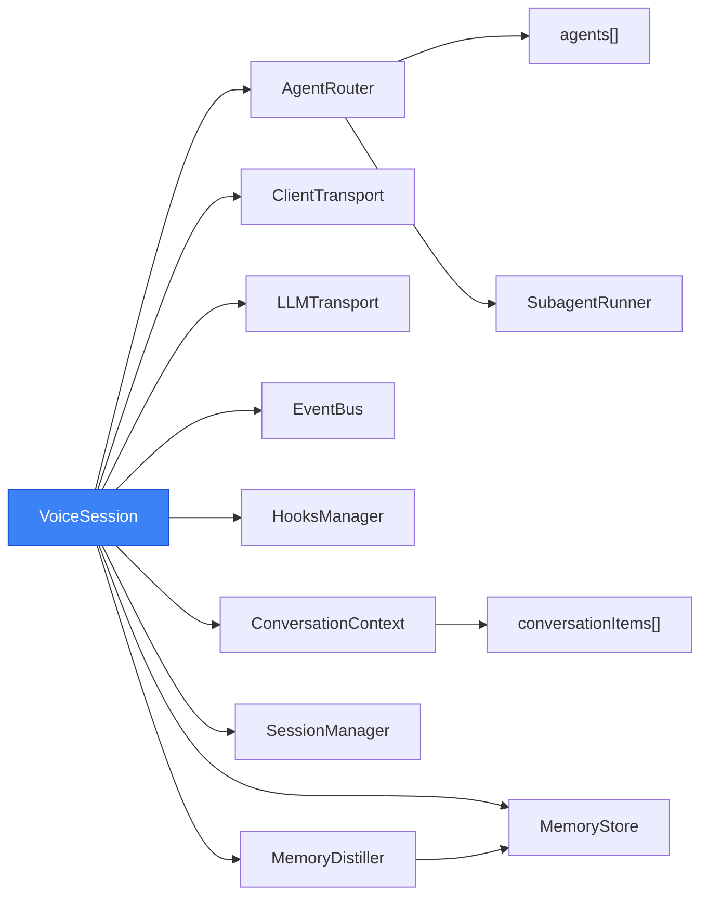

## How Agents, Tools, and the LLM Interact

Each agent provides its system instructions and tool set to the LLM. When the model calls a tool, the execution mode determines the path:

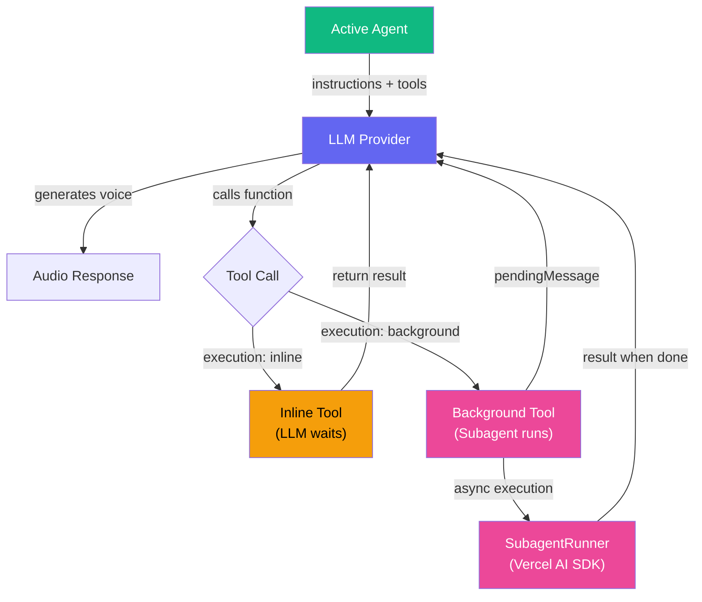

## Data Flow: A Single Voice Turn

This is what happens when a user speaks and gets a response:

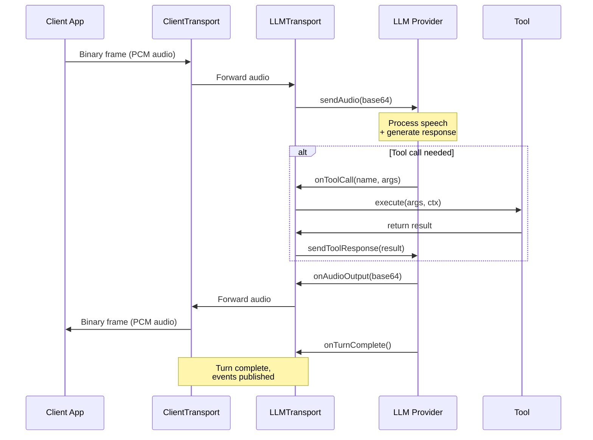

## Agent Transfer Flow

When the model calls `transferToAgent`, the framework handles the transition. For Gemini, this requires a reconnect; for OpenAI, it uses in-place `session.update`:

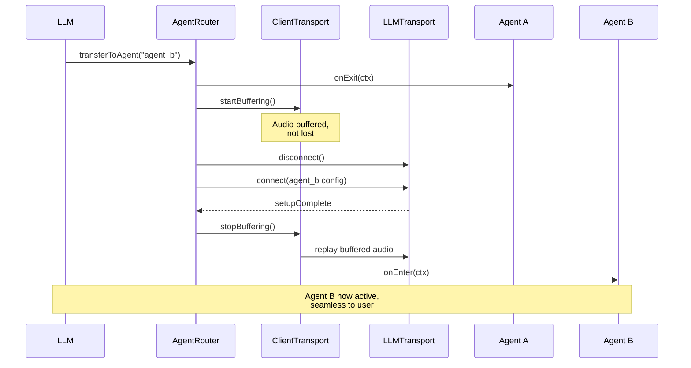

## Memory Extraction Pipeline

The memory system runs alongside conversation, extracting durable facts about the user:

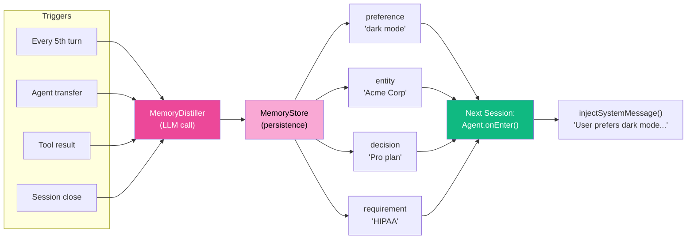

## EventBus Wiring

All framework components communicate through the EventBus. Hooks provide a curated subset:

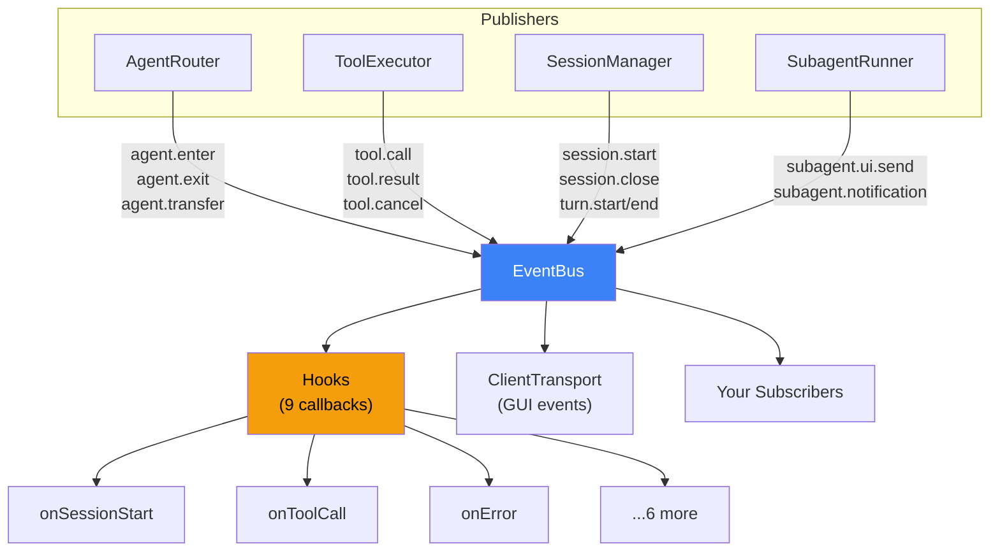

## Transport Layer

The `LLMTransport` interface abstracts provider differences. Two implementations are available:

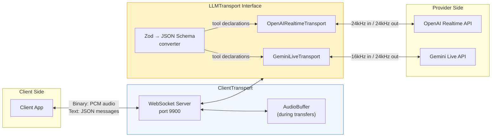

## Session State Machine

The `SessionManager` tracks the connection lifecycle:

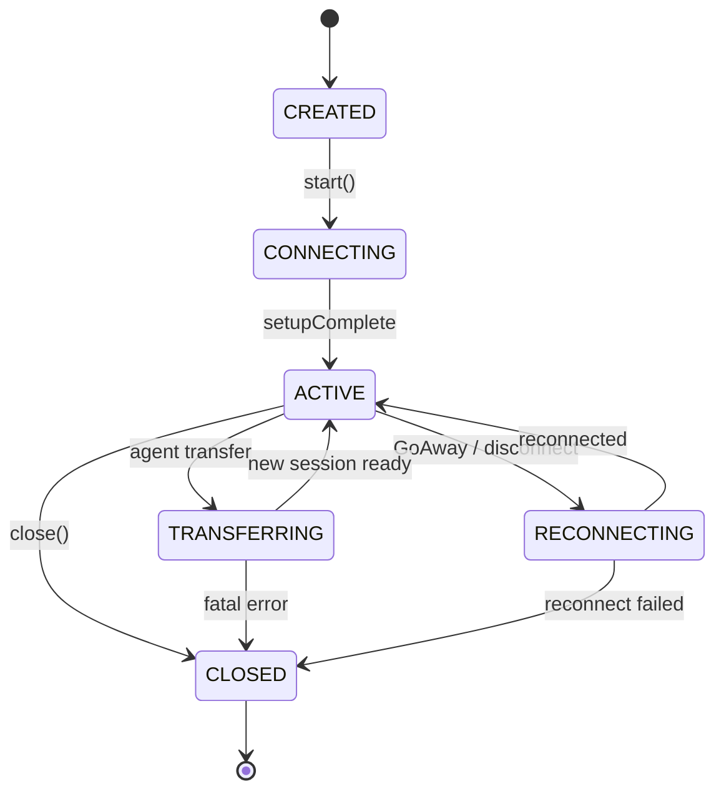

| State | ClientTransport | LLMTransport |
|-------|-----------------|--------------|
| CREATED | Not started | Not connected |
| CONNECTING | Listening | Connecting |
| ACTIVE | Forwarding audio | Streaming |
| TRANSFERRING | Buffering audio (Gemini) / Brief pause (OpenAI) | Reconnecting / session.update |
| RECONNECTING | Buffering audio | Reconnecting |
| CLOSED | Stopped | Disconnected |

## How Concepts Connect

### Agents → Tools → Subagents

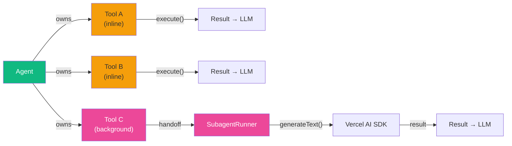

### Agents → Memory → Agents (cross-session)

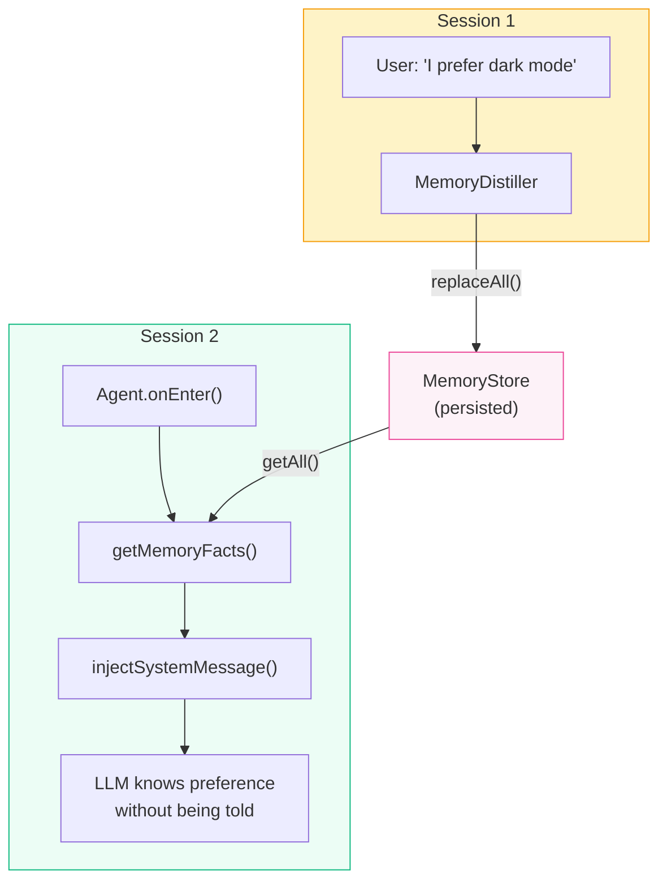

## Reading Order

If you're new to the framework, read the docs in this order:

1. **[VoiceSession](/guide/voice-session)** — The entry point. Understand how everything is wired.
2. **[Agents](/guide/agents)** — Define personalities and route conversations.
3. **[Tools](/guide/tools)** — Give agents the ability to take actions.
4. **[Memory](/guide/memory)** — Remember users across sessions.
5. **[Events & Hooks](/guide/events)** — Observe and react to everything happening.
6. **[Transport](/guide/transport)** — Understand the audio and message plumbing.
7. **[Subagent Patterns](/advanced/subagents)** — Background execution for complex tasks.
