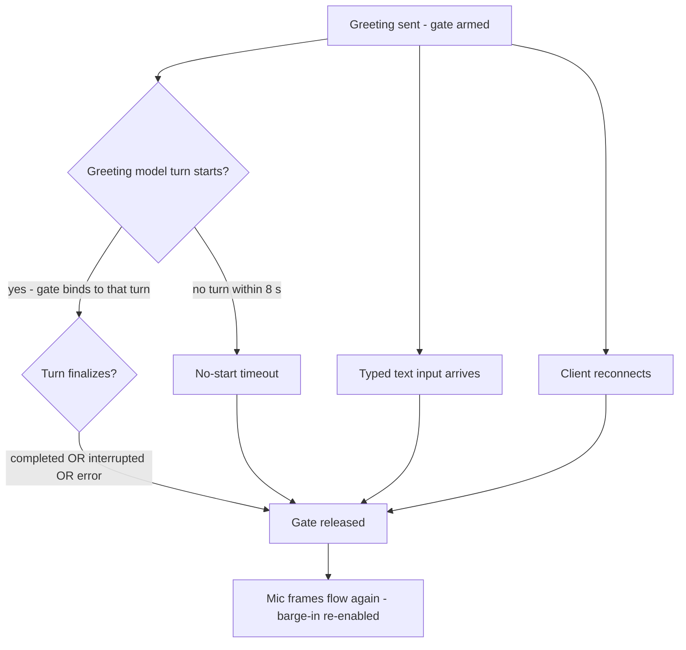

# Greeting Control

When an agent defines a `greeting`, `VoiceSession` speaks it as soon as the
client connects. The first seconds of a call are also the noisiest: the
browser's echo canceller has not converged yet, speakerphone users leak the
greeting back into the mic, and phone callers talk over the intro. Any of that
can register as barge-in and cut the greeting off mid-sentence.

The framework offers two independent protection mechanisms, from mildest to
strictest:

| Mechanism | Config | Window | Works on |
| --- | --- | --- | --- |
| Interrupt grace window | `greetingInterruptGraceMs` | First N ms after the first assistant audio chunk | Transports with `frameworkOwnsInterrupt` + `cancelResponse` |
| Full-greeting suppression | `greetingInterruptible: false` | From greeting send until the greeting turn finalizes (post-playback) | Every transport |

They compose: with both set, the grace window still covers post-greeting AEC
convergence after suppression releases.

```mermaid
gantt
  dateFormat X
  axisFormat %s
  section Greeting audio
  Model generates + client plays greeting : 0, 6
  section Grace window only
  Interrupts suppressed (greetingInterruptGraceMs) : crit, 0, 2
  Barge-in allowed : 2, 6
  section Full suppression
  Interrupts suppressed until turn finalizes (greetingInterruptible false) : crit, 0, 6
  Barge-in allowed : 6, 8
```



## Interrupt grace window

`greetingInterruptGraceMs` suppresses user-driven interrupts and drops outbound
mic frames for a short window after the session's **first assistant audio
chunk** — long enough for browser AEC to converge so the greeting's own echo
does not count as barge-in.

```ts
const session = new VoiceSession({
  // ...
  greetingInterruptGraceMs: 1500,
});
```

- When omitted, the transport's recommendation applies:
  `transport.capabilities.greetingInterruptGraceMs`. OpenAI Realtime defaults
  to 1000 ms when the framework owns interrupts; Gemini Live defaults to 0.
- Values are clamped to `[0, 5000]`.
- A session resolving a value > 0 against a transport that does not advertise
  `frameworkOwnsInterrupt` (or lacks `cancelResponse`) is downgraded to `0` at
  connect time with a warning log.
- **Phone sessions should pass `0` explicitly.** There is no browser AEC on a
  phone call, and dropping caller audio would silence real speech.

## Full-greeting suppression

`greetingInterruptible: false` makes the greeting uninterruptible end-to-end:

```ts
const session = new VoiceSession({
  // ...
  greetingInterruptible: false,
});
```

From the moment the greeting is sent until the greeting **turn finalizes**
(after client playback where the [playback gate](/guide/playback-gate) is
active, otherwise after the fallback/estimate timer), voice interrupts are
suppressed and outbound mic frames are dropped. User speech during the
greeting is **discarded, not queued** — the model never hears it.

Unlike the grace window, this works on every transport: withholding mic frames
means server-side VAD cannot barge in either, so no `frameworkOwnsInterrupt`
or `cancelResponse` support is needed.

### Release guarantees

A suppression gate that never released would leave the session deaf, so the
gate is bound to the greeting turn and releases on the first of:



- **Turn finalization for any reason.** The bound greeting turn releasing
  includes provider-side truncation and errors — not just clean completion.
- **Typed input pre-empts.** Suppression is voice-only by design: a typed
  message competes with the greeting, cancels it, and releases the gate.
- **No-start timeout.** A greeting whose response never produces a model turn
  releases after 8 s rather than waiting forever.
- **Client reconnect resets.** A new client connection never inherits a prior
  session's greeting window.

## Hosted app: per-surface operator policy

The bundled app server exposes suppression as per-surface environment
variables, applied when it constructs each session:

```bash
# unset or any other value = interruption enabled (default behavior)
GREETING_INTERRUPTION_ENABLED_WEB=false
GREETING_INTERRUPTION_ENABLED_MOBILE=false
GREETING_INTERRUPTION_ENABLED_PHONE=false
```

An explicit `false` / `0` / `no` makes that surface's greetings
uninterruptible end-to-end (`greetingInterruptible: false`). Any other value —
including unset — keeps greetings interruptible outside the grace window.

## Choosing a mechanism

- **Echo-only problem (headset/desktop web):** the grace window is usually
  enough, and it preserves the natural ability to interrupt a long greeting.
- **Greeting must land verbatim (compliance intros, IVR-style phone flows):**
  use full-greeting suppression. Remember the trade-off: real user speech
  during the greeting is dropped, so keep greetings short.
- **Speakerphone / mobile:** full suppression is the robust choice; device AEC
  quality varies too much for a fixed grace window.

## Related

- [Playback Gate](/guide/playback-gate) — how the greeting turn's finalization
  is tied to client playback.
- [Speech Evidence Model](/advanced/speech-evidence) — how gated-and-dropped
  speech is tracked so it can never trigger downstream recovery machinery.
- [Response Watchdog & Stall Recovery](/advanced/watchdog-recovery) — how a
  watchdog firing mid-greeting is held instead of tearing the greeting down.
