# Observability

The framework instruments the Human–Agent Interface (HAI) metrics that determine
whether a voice agent *feels* good — end-to-end latency, barge-in responsiveness,
turn-taking behavior — and ships an optional, dependency-free module that turns
those signals into Prometheus/OpenTelemetry metrics and a Grafana dashboard.

Two numbers anchor everything: human conversation has a natural turn gap of
**~200 ms**, and voice UX degrades sharply past **~800 ms** from "user stops
speaking" to "agent audio starts". The metrics below exist to validate those
targets in production.

## The four-layer model

Metrics are organized into four evaluation layers. Layers 1–3 are **live**
(emitted by the framework at runtime); the accuracy and business layers are
**offline** (computed by an evaluation pipeline after the call).

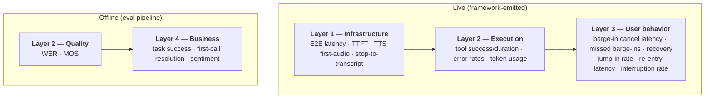

## Architecture

The core principle: **the framework core stays dependency-free**. `VoiceSession`,
the transports, and the tool executor emit typed, fire-and-forget events through
`FrameworkHooks`. Everything that aggregates or exports lives in the opt-in
`/observability` subpath — import nothing, pay nothing.

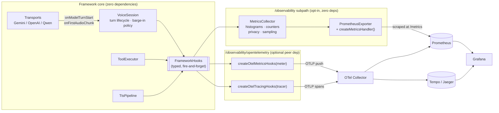

Three integration tiers, smallest first:

| Tier | What you do | What you get |
|---|---|---|
| Hooks only | Register your own `FrameworkHooks` handlers | Raw events into your own logger/APM |
| Prometheus | `MetricsCollector` + mount `createMetricsHandler()` | Pull-based `/metrics`, no new dependencies |
| OpenTelemetry | `createOtelMetricsHooks(meter)` (+ optional tracing) | OTLP push, Collector fan-out, turn-waterfall traces |

## Quick start (Prometheus)

```ts
import { VoiceSession } from '@bodhi_agent/realtime-agent-framework';
import {
  MetricsCollector,
  createMetricsHandler,
} from '@bodhi_agent/realtime-agent-framework/observability';

const collector = new MetricsCollector();

const session = new VoiceSession({
  // ...your config
  hooks: collector.hooks, // wire every metric event into the collector
});

// The framework owns no HTTP server — mount the handler on yours:
const metrics = createMetricsHandler(collector);
httpServer.on('request', (req, res) => {
  if (req.url === '/metrics') return metrics(req, res);
  // ...your routes
});
```

Point a Prometheus scrape job at that endpoint and you have live histograms.
A ready-made compose stack (Prometheus + Grafana + provisioned dashboard) lives
in [`observability/dashboards/`](../../observability/dashboards/README.md).

::: tip Already wired in this repo's app server
`pnpm start` mounts `/metrics` on the app server (default port **9900**) and
merges a server-wide `MetricsCollector` into every session's hooks — no code
needed to try it. See [Run it locally](#run-it-locally) below.
:::

## Run it locally

End-to-end verification on your machine: app → `/metrics` → Prometheus →
Grafana, with a real voice session driving the numbers.

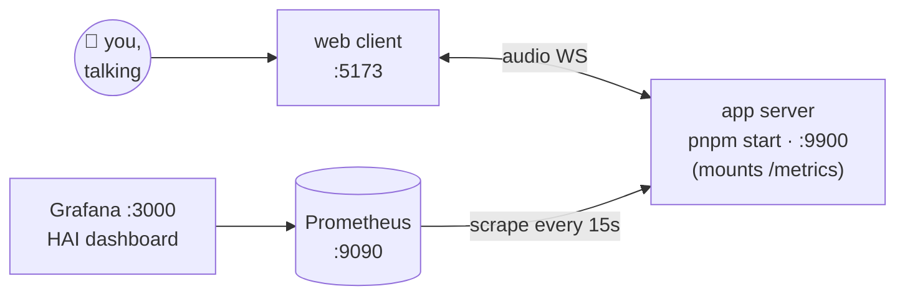

**1. Start the app server** (it mounts `/metrics` out of the box):

```bash
pnpm start          # app server on :9900
```

**2. Sanity-check the endpoint** — zeroed histograms before any session:

```bash
curl -s http://localhost:9900/metrics | head
# HELP voice_turn_latency_e2e_ms End-to-end stop-to-first-audio latency (ms).
# TYPE voice_turn_latency_e2e_ms histogram
# voice_turn_latency_e2e_ms_bucket{le="50"} 0
# ...
```

**3. Start Prometheus + Grafana** (scrape target defaults to
`host.docker.internal:9900`, matching step 1):

```bash
docker compose -f observability/dashboards/docker-compose.yml up
```

- Prometheus → <http://localhost:9090> — check **Status → Targets**: the
  `bodhi-voice-agent` job should be **UP**.
- Grafana → <http://localhost:3000> (anonymous admin) — the **Bodhi Voice
  Agent — HAI Metrics** dashboard is provisioned automatically.

**4. Drive real traffic** — run the web client and have a conversation:

```bash
pnpm web-client     # then open it in the browser and talk
```

**5. Verify the metrics move.** After a few turns:

```bash
curl -s http://localhost:9900/metrics | grep -E "_count|_total" | grep -v " 0$"
```

| Do this | Expect to move |
|---|---|
| Complete a few spoken turns | `voice_turn_latency_e2e_ms_count`, `voice_turns_total`, `voice_stop_to_transcript_ms_count` |
| Interrupt the agent mid-sentence | `voice_bargein_total{successful="true"}`, `voice_turns_interrupted_total`, then `voice_bargein_recovered_total` on your next clean turn |
| Try interrupting during the greeting grace | `voice_bargein_total{successful="false"}` (a missed barge-in) |
| Let a tool-using agent run a tool | `voice_tool_total{status="completed"}` |

In Grafana, the Layer-1 latency percentiles and Layer-3 barge-in panels fill in
as Prometheus accumulates samples (rate windows need a couple of minutes of
data to render percentiles).

**Cleanup:** `Ctrl-C` the app server; `docker compose -f
observability/dashboards/docker-compose.yml down` for the stack.

::: details Troubleshooting
- **Target DOWN in Prometheus** — the container reaches your host via
  `host.docker.internal`; on Linux this requires the `extra_hosts:
  host-gateway` entry already present in the compose file. Also confirm the
  app port matches `prometheus.yml` (`PORT` env overrides 9900).
- **`/metrics` 404** — the route only answers `GET /metrics` on the app
  server's HTTP port (not the web-client dev-server port).
- **Panels empty but counters non-zero** — percentile panels use 5m `rate()`
  windows; wait ~2 minutes or tighten the dashboard time range.
:::

## Anatomy of a turn's latency

Every turn stamps a small set of edges on a **single injectable clock**
(`VoiceSessionConfig.nowMs`, default `Date.now`). The segments are computed at
turn finalization and emitted once through `onTurnLatency`.

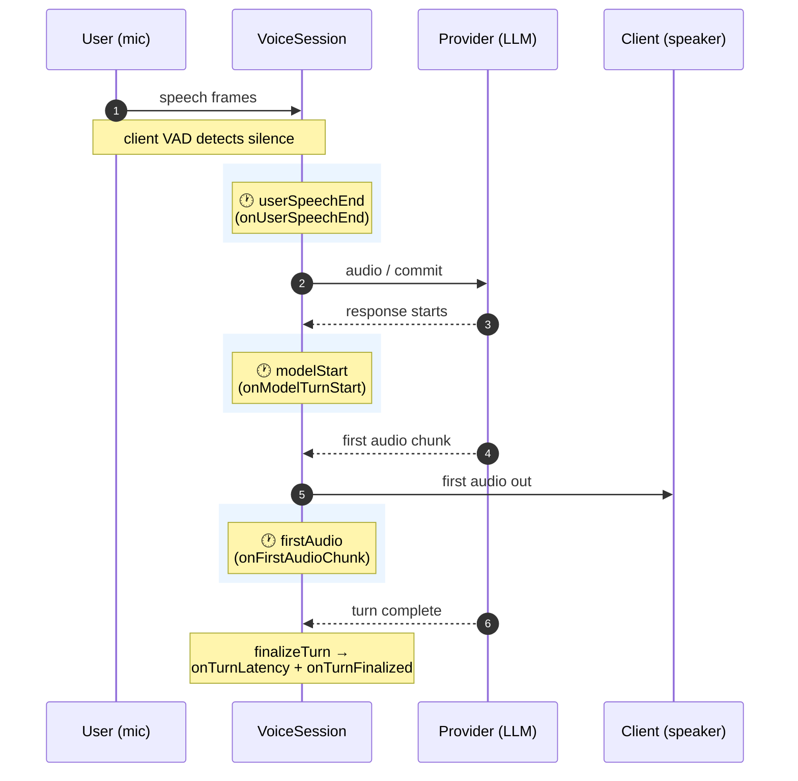

The three stamps produce the segment breakdown:

```mermaid
gantt
  dateFormat X
  axisFormat %L ms
  section Turn timeline
  geminiProcessingMs (user stop → provider start, ≈TTFT) :a, 0, 300
  backendToClientMs (provider start → first audio out)    :b, 300, 450
  totalE2EMs — stop-to-first-audio (the headline)         :crit, 0, 450
```

```ts
hooks.onTurnLatency = ({ sessionId, turnId, segments }) => {
  // segments.totalE2EMs          — stop-to-first-audio (target < 800ms, aspire ~300ms)
  // segments.geminiProcessingMs  — user stop → provider response start (≈ TTFT)
  // segments.backendToClientMs   — provider start → first audio to the client
};
```

::: tip Transport-agnostic naming
The segment field names (`geminiProcessingMs`, `backendToGeminiMs`) are
historical — they carry the same meaning on OpenAI and Qwen transports. Only
`totalE2EMs`, `geminiProcessingMs`, and `backendToClientMs` are populated today;
the other typed fields are reserved.
:::

Tool-only turns produce no audio, so no latency event is emitted for them —
the histogram never mixes "spoke back" with "ran a tool silently".

## Anatomy of a barge-in

Barge-in metrics anchor on **detection → cancel actuation**, *not* on speech
end — the user is still mid-sentence when the agent must shut up.

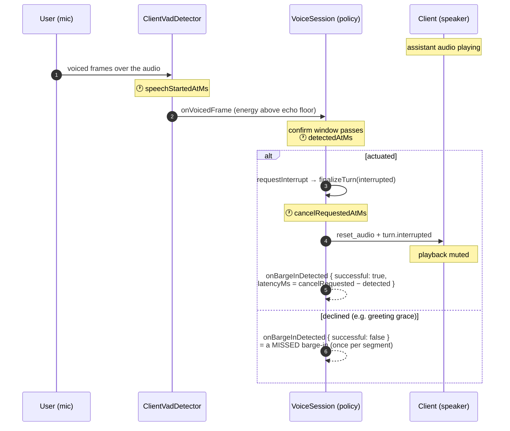

From these events the collector derives the Layer-3 health picture:

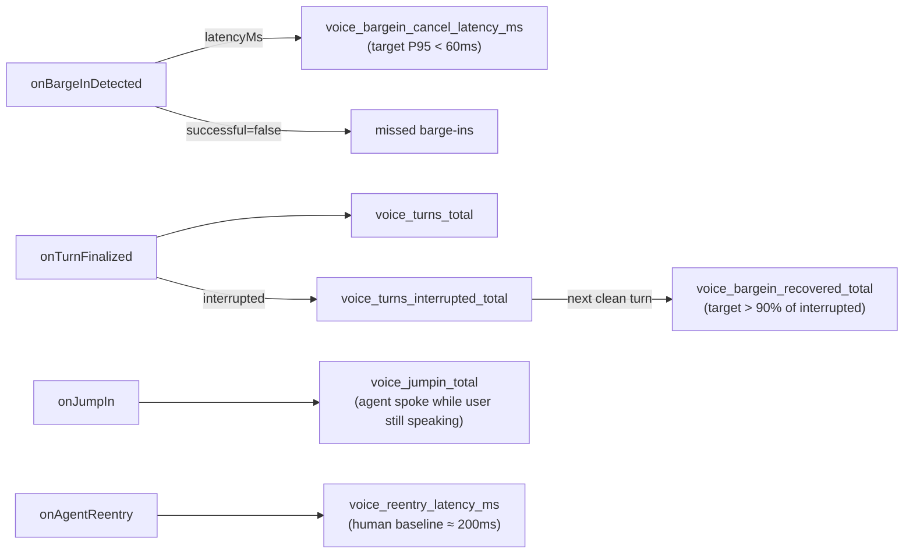

- **Jump-in (JIR)** — the agent's first audio chunk arrives while the client VAD
  still has an active speech segment: a false turn-end.
- **Re-entry latency** — the pause between yielding to an interrupt and the
  agent's next audio.
- **Recovery** — an interrupted turn followed by a turn that finalizes cleanly.

## Hook interfaces

All hooks are optional, synchronous, and fire-and-forget — exceptions are caught
and logged, and an unregistered hook costs nothing. Register them via
`VoiceSessionConfig.hooks` or `HooksManager.register()`. Source of truth:
[`FrameworkHooks`](../api/interfaces/FrameworkHooks.md) in `src/types/hooks.ts`.

The observability-specific hooks:

```ts
interface FrameworkHooks {
  /** Per-turn latency breakdown, once per finalized turn that produced audio. */
  onTurnLatency?(event: {
    sessionId: string;
    turnId: string;
    segments: {
      geminiProcessingMs?: number; // user stop → provider start (≈TTFT)
      backendToClientMs?: number;  // provider start → first audio out
      totalE2EMs: number;          // stop-to-first-audio (headline)
      // clientToBackendMs / backendToGeminiMs / geminiToBackendMs: reserved
    };
  }): void;

  /** End-of-user-speech (VAD end) — the S2FA / S2T anchor. */
  onUserSpeechEnd?(event: { sessionId: string; turnId?: string; atMs: number }): void;

  /** User transcript finalized. Carries textLength only — never the text. */
  onTranscriptReady?(event: {
    sessionId: string; turnId?: string; atMs: number; textLength: number;
  }): void;

  /** Client-VAD barge-in detected. latencyMs = cancelRequestedAtMs − detectedAtMs.
   *  successful=false marks a missed barge-in (detected but declined). */
  onBargeInDetected?(event: {
    sessionId: string;
    speechStartedAtMs: number;
    detectedAtMs: number;
    cancelRequestedAtMs: number;
    audioStoppedAtMs?: number;
    latencyMs: number;
    successful: boolean;
  }): void;

  /** Every finalized turn — clean or interrupted (rates' denominator). */
  onTurnFinalized?(event: { sessionId: string; turnId: string; interrupted: boolean }): void;

  /** Agent audio started while the user was still speaking (false turn-end). */
  onJumpIn?(event: { sessionId: string; turnId?: string }): void;

  /** Pause between yielding to an interrupt and the agent's next audio. */
  onAgentReentry?(event: { sessionId: string; reentryMs: number }): void;
}
```

These compose with the pre-existing hooks (`onTTSSynthesis`, `onToolCall` /
`onToolResult`, `onRealtimeLLMUsage`, `onSessionStart` / `onSessionEnd`,
`onError`) — the collector consumes those too.

### Clock discipline

All duration math runs on **one clock**. `VoiceSession` accepts an injectable
time source, shared with the VAD detector, so no duration is ever computed by
subtracting timestamps from different clocks:

```ts
const session = new VoiceSession({
  // ...
  nowMs: () => Date.now(), // default; inject a fake clock in tests
});
```

The transport layer contributes two uniform timing callbacks, wired identically
across Gemini, OpenAI, and Qwen:

- `onModelTurnStart` — provider began **any** response (audio or tool call)
- `onFirstAudioChunk` — first audio chunk of the response, once per response
  (the stop-to-first-audio anchor; re-arms when a new response begins)

## Metric reference

What the `MetricsCollector` exposes on `/metrics` (Prometheus exposition,
rendered by `renderPrometheus`):

| Metric | Type | Layer | Meaning | Target |
|---|---|---|---|---|
| `voice_turn_latency_e2e_ms` | histogram | 1 | stop-to-first-audio | P95 < 800 ms (aspire ~300) |
| `voice_turn_provider_processing_ms` | histogram | 1 | user stop → provider start (≈TTFT) | 100–500 ms |
| `voice_turn_backend_to_client_ms` | histogram | 1 | provider start → first audio out | — |
| `voice_stop_to_transcript_ms` | histogram | 1 | user stop → transcript finalized | provider-dependent |
| `voice_tts_ttfb_ms{provider}` | histogram | 1 | TTS time-to-first-byte (cascaded TTS path) | 75–200 ms |
| `voice_tool_duration_ms{status}` | histogram | 2 | tool execution duration | — |
| `voice_tool_total{status}` | counter | 2 | tool results by status | — |
| `voice_error_total{component,severity}` | counter | 2 | framework errors | — |
| `voice_bargein_cancel_latency_ms` | histogram | 3 | detect → cancel actuation | P95 < 60 ms |
| `voice_bargein_total{successful}` | counter | 3 | barge-ins (false = missed) | missed ≈ 0 |
| `voice_turns_total` | counter | 3 | finalized turns (denominator) | — |
| `voice_turns_interrupted_total` | counter | 3 | interrupted turns | trend |
| `voice_bargein_recovered_total` | counter | 3 | interrupted → clean next turn | > 90 % |
| `voice_jumpin_total` | counter | 3 | agent spoke over the user | ≈ 0 |
| `voice_reentry_latency_ms` | histogram | 3 | yield → next agent audio | ≈ 200 ms human baseline |
| `voice_eval_*` | gauge | 2/4 | offline eval (WER, MOS, TSR, FCR, sentiment) — pushed, not scraped | see [Offline evaluation](#offline-evaluation) |

Percentiles are computed **by Prometheus at query time**
(`histogram_quantile` over the `le` buckets) — the in-process collector keeps
only fixed-bucket counts, so its memory is constant.

## OpenTelemetry

For OTLP push instead of (or alongside) Prometheus pull, use the
`/observability/opentelemetry` subpath. `@opentelemetry/api` is an **optional
peer dependency** — installing the framework alone never pulls it.

```ts
import { MeterProvider } from '@opentelemetry/sdk-metrics';
import {
  createOtelMetricsHooks,
  createOtelTracingHooks,
  mergeHooks,
} from '@bodhi_agent/realtime-agent-framework/observability/opentelemetry';

const meter = new MeterProvider({ readers: [otlpReader] }).getMeter('voice-agent');

const session = new VoiceSession({
  // ...
  hooks: mergeHooks(
    createOtelMetricsHooks(meter),          // histograms + counters via OTLP
    createOtelTracingHooks(tracer),         // optional: turn-waterfall spans
  ),
});
```

The tracing hooks reconstruct a per-turn span tree — useful when one slow turn
needs a *why*, not just a percentile:

```mermaid
gantt
  dateFormat X
  axisFormat %L ms
  section voice_turn (span)
  provider_processing : 0, 300
  backend_to_client   : 300, 450
```

::: warning Traces need a trace backend
Prometheus stores metrics only. The span path requires Tempo or Jaeger behind
the OTel Collector — see the separate
[`observability/otel-config.traces.yml`](../../observability/otel-config.traces.yml)
template. The default collector template
([`observability/otel-config.yml`](../../observability/otel-config.yml)) is
metrics-only: OTLP in, Prometheus-scrapeable out.
:::

## Privacy, cardinality, and sampling

The collector is privacy-safe **by construction**, with configurable hardening
on top:

```ts
const collector = new MetricsCollector({
  privacy: {
    maxLabelCardinality: 50, // fold extra label values to "other" (logged once)
    sessionSamplingRate: 1,  // 0..1 — fraction of sessions fully recorded
    slowTurnMs: 1500,        // turns at/above this are ALWAYS kept
  },
  log: (msg) => console.warn(msg),
});
```

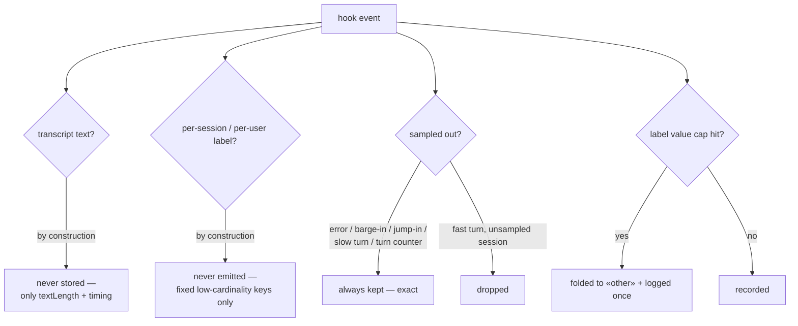

Key properties:

- **No transcript text, ever** — `onTranscriptReady` carries `textLength` only.
- **No per-entity series** — session/user IDs never become metric labels, so
  cardinality cannot grow with traffic.
- **Event-biased sampling** — sampling drops only high-volume routine
  observations. Errors, barge-ins, jump-ins, re-entries, slow turns, and *all
  turn counters* bypass it, so derived rates (recovery %, interruption %) stay
  exact even at `sessionSamplingRate: 0.1`.
- **No silent truncation** — the cardinality guard logs once per dimension when
  it starts folding.

## Dashboards and deployment

A turnkey self-hosted stack lives in `observability/dashboards/`:

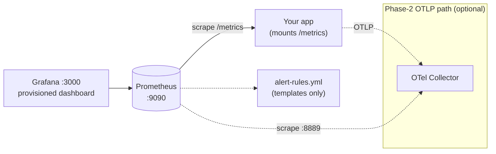

```bash
docker compose -f observability/dashboards/docker-compose.yml up
# Grafana → http://localhost:3000   Prometheus → http://localhost:9090
```

The provisioned **Bodhi Voice Agent — HAI Metrics** dashboard has one row per
layer: latency percentiles with the 800 ms threshold line, tool/error rates,
barge-in health (cancel P95, recovery stat, interruption/jump-in rates), and the
offline quality/business row.

Shipped alert-rule **templates** (the framework does not run Alertmanager):

| Alert | Condition |
|---|---|
| `VoiceE2ELatencyP95High` | E2E P95 > 800 ms for 5 m |
| `VoiceBargeInCancelLatencyP95High` | cancel P95 > 60 ms for 5 m |
| `VoiceBargeInRecoveryLow` | recovery rate < 90 % for 15 m |
| `VoiceWERHigh` / `VoiceMOSLow` / `VoiceTaskSuccessLow` | offline-eval regressions |

## Offline evaluation

WER, MOS, task success, FCR, and sentiment can't be measured live — they need
reference transcripts, human raters, or post-call labeling. The framework ships
the pure pieces; the pipeline around them is yours:

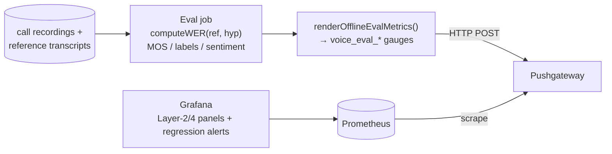

```ts
import {
  computeWER,
  renderOfflineEvalMetrics,
} from '@bodhi_agent/realtime-agent-framework/observability';

const wer = computeWER('how are you doing', recognizedTranscript);

const body = renderOfflineEvalMetrics(
  { wer, mos: 4.4, taskSuccess: true, firstCallResolution: true, sentimentScore: 0.3 },
  { agent: 'interview' }, // low-cardinality grouping labels only — never per-call PII
);
await fetch('http://pushgateway:9091/metrics/job/voice-eval', { method: 'POST', body });
```

`computeWER` is a word-level Levenshtein distance (substitutions + insertions +
deletions over reference length), case- and whitespace-insensitive.

## See also

- [Events & Hooks](./events.md) — the full `FrameworkHooks` / EventBus surface
- [Playback Gate](./playback-gate.md) — the playback handshake the barge-in path builds on
- [Transport](./transport.md) — where `onModelTurnStart` / `onFirstAudioChunk` come from
- [`observability/dashboards/README.md`](../../observability/dashboards/README.md) — stack wiring walkthrough
- Design history: `dev_docs/framework/investment-hai-metrics-observability.md` (decisions, alternatives, phased plan)
