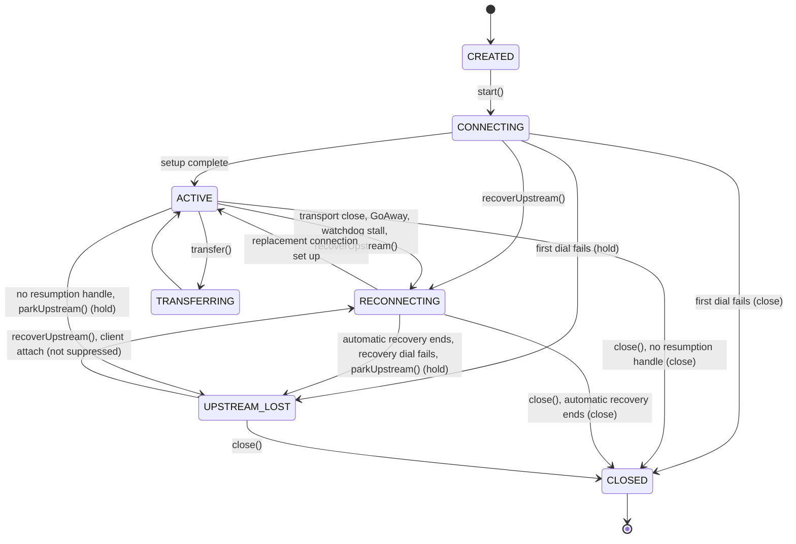

# VoiceSession

`VoiceSession` is the top-level runtime integration point.

**How this fits the two network legs** (browser or device vs cloud model):

```text
[Browser or device] ─── Leg 1 ───> [App server / VoiceSession] ─── Leg 2 ───> [Gemini or OpenAI]
```

- **Leg 1:** `IClientChannel` / `clientSender` / `clientMedia` — your app’s WebSocket (and optional WebRTC) to the user.
- **Leg 2:** `LLMTransport` — the server’s separate realtime session to the vendor. Independent of Leg 1’s encoding.

It manages:

- live transport connection
- agent/tool orchestration
- turn lifecycle
- subagent execution handoff
- optional memory/history/artifact integration

## External TTS

`VoiceSession` can run with a pluggable `ttsProvider` in actor mode. When present, the realtime transport is configured for text responses (`responseModality: 'text'`), and `VoiceSession` forwards model text deltas into the provider. The provider returns PCM chunks through `onAudio`; `VoiceSession` resamples them to the client output rate when needed and delays turn-complete notifications until TTS audio is done.

Framework providers:

- `CartesiaTTSProvider`
- `ElevenLabsTTSProvider`
- `HumeTTSProvider`

Use native realtime-model audio by omitting `ttsProvider`.

### App-Level Selection

The framework accepts a `ttsProvider` instance; the app layer turns saved agent/UI choices into that instance.


### Cartesia Presets

The app’s curated Cartesia choices use `sonic-3.5` by default. Cartesia documents Sonic 3.5 as its current streaming TTS model and recommends stable, realistic voices for voice agents, including Katie and Jameson. The app exposes those as named choices so users do not start from raw voice IDs.

Custom Cartesia setup is still available for advanced users and exposes:

- `sonic-3.5` for stable current behavior.
- `sonic-3.5-2026-05-04` for pinned behavior.
- `sonic-latest` for beta testing.
- `sonic-3` and `sonic-3-2026-01-12` for flows that need speed/emotion controls.

Speed and emotion fields are intentionally advanced/custom controls; curated presets keep the choice to one dropdown.

### ElevenLabs And Hume Presets

ElevenLabs custom setup mirrors the Cartesia pattern: users still can enter a custom voice ID, but model and language are dropdown choices. Current model choices are `eleven_flash_v2_5` for realtime agent use, `eleven_flash_v2`, `eleven_multilingual_v2` for high-fidelity multilingual output, and `eleven_v3` for expressive creative output. The curated ElevenLabs choices include Rachel, Alita, and George so normal users do not start from an empty voice-ID box.

Hume custom setup exposes voice name, voice ID, `HUME_AI` vs `CUSTOM_VOICE`, Octave version, speed, and acting instructions. Curated Hume choices include Ava Song on Octave 1, Ava Song on Octave 2 preview, and a prompt-guided warm assistant style. Raw Hume IDs are reserved for users who selected or created a specific Hume voice.

## Client connection modes

`VoiceSession` supports two ways to attach an end-user client:

1. **Local `ClientTransport` (default in simple examples)** — the framework listens on a TCP port and attaches one real client at a time. Health probes (`?probe=1`), a background verifier (`?verify=1`) and a user-confirmed takeover (`?takeover=1`) are recognized from the connection URL; see [Local client connection roles](#local-client-connection-roles).
2. **Server-owned WebSocket (`clientSender`)** — your app server holds the WebSocket and forwards **binary** and **JSON** into `feedAudioFromClient` / `feedJsonFromClient`, and calls `notifyClientConnected` / `notifyClientDisconnected` when the socket opens or closes.

When you use **`clientSender`**, you must also choose how **media** is carried:

- **`clientMedia: { kind: 'websocket' }`** (default) — PCM mic up and assistant PCM down on the **same WebSocket** as JSON (binary frames).
- **`clientMedia: { kind: 'direct_rtc', rtcAudio?: 'none' | 'werift_opus', … }`** — JSON (including `session.config`, transcripts, and **`rtc.offer` / `rtc.answer` / `rtc.ice_candidate`**) stays on the WebSocket; with **`rtcAudio: 'werift_opus'`**, mic and assistant audio use **Opus RTP** on a WebRTC peer connection owned inside the framework channel; the framework loads the engine on first use. This does **not** replace the **`LLMTransport`** socket to Gemini/OpenAI.

`direct_rtc` **requires** `clientSender` (the factory throws if it is missing).

## Typical setup (local `ClientTransport`)

```ts
const session = new VoiceSession({
  sessionId: 'session_1',
  userId: 'user_1',
  apiKey: process.env.GEMINI_API_KEY!,
  agents: [mainAgent],
  initialAgent: 'main',
  model: google('gemini-2.5-flash'),
  port: 9900,
  orchestrationMode: 'actor',
});
```

## Local client connection roles

The local `ClientTransport` reads the query string of each WebSocket upgrade
request before it attaches the connection. One connection holds the client slot
at a time, and only a real client counts as the attached client.

| Connection URL | Role | Behavior |
|----------------|------|----------|
| `ws://host:port/` (no role query) | Real client | Attaches and runs connect handling (greeting, `session.config`). While another real client is attached, the newcomer is closed with `4409` `client-busy` and the incumbent is unaffected. If a verifier holds the slot, the verifier is closed with `4411` `verifier-preempted` and the newcomer attaches. |
| `?probe=1` | Health probe | The upgrade completes, the probe receives one JSON text frame from `probeState` when that option is configured (no frame otherwise), and the socket closes with `1000`. A probe never attaches, never runs connect or disconnect handling, and leaves an attached client untouched. |
| `?verify=1` | Verifier | Low-priority background check. Attaches only when the slot is free; while a real client or another verifier is attached it is closed with `4409` `client-busy`. It receives outbound frames, but its inbound audio and JSON are dropped, and it never counts as the attached client, so it gets no greeting and no `session.config`. A real client arriving preempts it with `4411` `verifier-preempted`. |
| `?takeover=1` | Real client (takeover) | Closes an attached real client with `4410` `superseded-by-takeover`, then attaches in its place. With no incumbent it attaches like any real client. |

A socket that loses the slot through takeover or preemption can no longer send
audio or JSON into the session. An incumbent whose socket is already closing
does not hold the slot, so an immediate reconnect from the same user is not
rejected as busy.

Clients can branch on the close code: on `4409` a real client can tell the user
another client is connected and, once the user confirms, reconnect with
`?takeover=1`; a verifier closed with `4409` or `4411` should retry later; a
client closed with `4410` was replaced on purpose and should not reconnect on
its own. The codes and reasons are exported from `bodhi-realtime-agent` as
`CLOSE_CODE_CLIENT_BUSY` / `CLOSE_REASON_CLIENT_BUSY`,
`CLOSE_CODE_SUPERSEDED_BY_TAKEOVER` / `CLOSE_REASON_SUPERSEDED_BY_TAKEOVER`
and `CLOSE_CODE_VERIFIER_PREEMPTED` / `CLOSE_REASON_VERIFIER_PREEMPTED`.

Three `VoiceSession` options configure these roles:

```ts
const session = new VoiceSession({
  // ...same options as above
  port: 9900,
  // Sent as one JSON text frame to each ?probe=1 connection.
  probeState: () => ({ type: 'app.health', ready: true }),
  // Verifier attached: a narrow hook, for example to wake the upstream.
  onVerifierConnected: () => {},
  // Verifier detached: clean close or preemption by a real client.
  onVerifierDisconnected: () => {},
});
```

- **`probeState`** returns the object sent to a probe. If it is absent, or it
  throws, the probe still closes with `1000`, without a frame.
- **`onVerifierConnected` / `onVerifierDisconnected`** fire for the verifier
  only. Real-client connect and disconnect handling never runs for a verifier,
  so these hooks should not start user-facing work.

These roles apply to the local `ClientTransport` only. With `clientSender` your
server performs the WebSocket upgrade, so the framework never sees the query
string; implement probes and roles in your server. Passing `probeState` or the
verifier hooks together with `clientSender` logs a warning.

## Typical setup (app server owns the WebSocket, PCM on socket)

```ts
const session = new VoiceSession({
  sessionId: 'session_1',
  userId: 'user_1',
  apiKey: process.env.GEMINI_API_KEY!,
  agents: [mainAgent],
  initialAgent: 'main',
  model: google('gemini-2.5-flash'),
  clientSender: mySender, // implements SessionClientSender
  // clientMedia defaults to { kind: 'websocket' }
});
```

## Typical setup (app server owns the WebSocket, Opus RTP for audio)

```ts
const session = new VoiceSession({
  sessionId: 'session_1',
  userId: 'user_1',
  apiKey: process.env.GEMINI_API_KEY!,
  agents: [mainAgent],
  initialAgent: 'main',
  model: google('gemini-2.5-flash'),
  clientSender: mySender,
  clientMedia: {
    kind: 'direct_rtc',
    iceServers: [{ urls: 'stun:stun.l.google.com:19302' }],
    rtcAudio: 'werift_opus',
  },
});
```

The framework wires PCM rates and inbound PCM delivery when `rtcAudio === 'werift_opus'`; your server still implements **`clientSender`** and relays JSON frames unchanged.

The root `bodhi-realtime-agent` entry has no native dependencies, so it bundles (for example with esbuild) without `.node` loaders. The werift + `@evan/opus` engine ships inside the package as an internal module, not as a public entry point, and a `werift_opus` session loads it on the first `rtc.offer`; no configuration change is needed. Only the package's own files can load that module, so `werift_opus` needs `bodhi-realtime-agent` loaded from its installed package: an app bundle that inlines the root entry cannot reach the engine and reports the load failure. If the load fails, the session logs a line naming the internal engine entry and sends the client one `rtc.error` frame.

## Client attach hooks and host commands

These options apply to both connection modes. A client attach is a real
client on the local `ClientTransport` (never a probe or verifier) or a
`notifyClientConnected()` call with `clientSender`.

```ts
const session = new VoiceSession({
  // ...
  // Client frames whose type is not a built-in, after onClientJson.
  onClientCommand: (message) => {
    if (message.type === 'app.retry') retryFromClient();
  },
  // A real client attached: runs before session.config and any greeting.
  onClientConnected: () => resendAppState(),
  onClientDisconnected: () => {},
  // While true, an attach configures the client and does nothing else.
  suppressClientAutoActions: () => hostOwnsRecovery,
  reattachGreeting: 'until-first-turn',
  reattachContextReplay: true,
});
```

- **`onClientCommand`** receives each client JSON frame whose `type` the
  session does not handle itself, after `onClientJson`. Built-in frames
  (`behavior.set`, `ui.response`, `file_upload`, `text_input`,
  `playback.ended`) never reach it; a built-in frame with a malformed payload
  is dropped with a log line and reaches neither hook. Frames that arrive
  before `session.config` has been sent are queued (up to 64) and delivered
  after it. A throw from `onClientJson` or `onClientCommand` is reported
  through `hooks.onError`; the other hook, the remaining queued frames and
  the attach still run.
- **`onClientConnected`** runs synchronously once `clientConnected` is `true`,
  before the behavior catalog, `session.config` and any greeting.
  **`onClientDisconnected`** runs at the end of the detach, once
  `clientConnected` is `false`. A throwing hook is reported through
  `hooks.onError` and does not stop the attach or detach.

After the client is configured, an attach acts on the session state:

| State at attach | What the attach does |
|-----------------|----------------------|
| `ACTIVE` | Sends the agent's greeting, if it has one, once per attached client under `reattachGreeting: 'per-client'` (the default). Under `'until-first-turn'` it greets only while no turn has completed; after that, with `reattachContextReplay: true`, it injects the last ten user and assistant messages as quiet context instead (no response is requested, and nothing is injected while synthetic output is held). |
| `UPSTREAM_LOST` | Redials with `recoverUpstream({ reason: 'human-retry', skipContextInjection: false, holdSyntheticUntilFreshSpeech: false })`: a fresh dial without the resumption handle, no greeting, and quiet recent context once the session is `ACTIVE` again. A failed dial parks the session again. |
| Any other state | Nothing more. A client attached before the first setup completes is greeted, under the same policy, when it does. |

`suppressClientAutoActions` is read once per attach, after `session.config`
is sent. While it returns `true` the attach sends no greeting, injects no
context and does not redial. Under `upstreamLossPolicy: 'hold'` the
reconnector reads it too: while it returns `true` the host owns recovery, so
a lost provider connection parks the session instead of reconnecting on its
own. Both reads log a throw from the gate and treat it as `false`.

`session.clientConnected` reports whether a real client is attached. On the
local `ClientTransport`, `getClientSocketHealth()` returns the attached
socket's `{ readyState, bufferedAmount }` (`null` when none is attached), and
`closeClientConnection(code, reason)` closes that socket, for example with
`4000, 'goodbye'`, while the listener keeps accepting clients and the session
stays up. With `clientSender` your server owns the socket, so
`getClientSocketHealth()` returns `null` and `closeClientConnection()` returns
`false`.

## Playback gate

For client surfaces that can report when audio has actually finished playing,
`VoiceSession` can enable the playback gate with
`playbackStateProtocol: 'audio_done'`. The server sends `audio.done` after the
turn's final audio frame, and the client replies with `playback.ended` after its
audio buffer drains. This keeps the turn interruptible during buffered playback
instead of completing as soon as synthesis or generation finishes.

When you provide a server-owned `clientSender`, set
`supportsPlaybackStateProtocol: true` only if the sender implements ordered
`sendJsonAfterAudio` and the client renders assistant audio through that same
buffered PCM path. Surfaces that cannot report playback completion should leave
the protocol disabled and use the server fallback timer.

See [Playback Gate](/guide/playback-gate) for the wire messages, supported
surfaces, and client behavior.

## Upstream loss and host recovery

The provider connection (Leg 2) can drop while the client stays attached.
`VoiceSession` first recovers on its own: a GoAway resumes at once with the
session resumption handle, and a transport close or a response-watchdog stall
starts up to three backed-off reconnects with that handle.
`upstreamLossPolicy` decides what happens when this automatic recovery cannot
continue (the attempts are spent, there is no resumption handle, or an attempt
fails or times out):

| `upstreamLossPolicy` | Automatic recovery ends | The first dial in `start()` fails |
|----------------------|-------------------------|-----------------------------------|
| `'close'` (default) | The session closes with `reconnect_failed`: `session.close` and `onSessionEnd` fire and the post-session pipeline runs. | `start()` rejects and the session closes with `connect_failed`. |
| `'hold'` | The session parks in `UPSTREAM_LOST`. Nothing is finalized, the client listener stays up, and `session.upstreamLost` is published. | `start()` rejects and the session parks in `UPSTREAM_LOST`. |



`UPSTREAM_LOST` exists only under `'hold'`. While parked, no microphone audio
reaches the model, an external STT provider is stopped, and background
notifications and framework-generated output (greeting, directive
reinforcement) are held. Two things redial a parked session: your call to
`recoverUpstream()`, and a client attach while `suppressClientAutoActions`
does not return `true`, which calls `recoverUpstream()` itself (see
[Client attach hooks and host commands](#client-attach-hooks-and-host-commands)).
Nothing else does. `close()` finalizes a parked session as usual.
`session.upstreamLost` carries `{ sessionId, reason, code?, detail? }`, where
`reason` is `'reconnect-exhausted'`, `'no-resumption-handle'`,
`'reconnect-failed'`, `'reconnect-timeout'`, `'connect-failed'`,
`'host-owns-recovery'`, `'recover-upstream-failed'` or `'host-parked'`, and
`code`/`detail` carry the transport close code and reason or the error text
when known.

`'hold'` requires legacy orchestration: combining it with
`orchestrationMode: 'actor'` throws a `ValidationError` at construction.

### Redialing with `recoverUpstream()`

```ts
const session = new VoiceSession({
  // ...
  upstreamLossPolicy: 'hold',
});

session.eventBus.subscribe('session.upstreamLost', ({ reason }) => {
  // Do not retry a deliberate parkUpstream().
  if (reason === 'host-parked') return;
  if (!session.getRecoveryCapabilities().recoverUpstream) return;
  // Retry after a pause: a recovery that fails parks the session again.
  setTimeout(() => {
    if (session.sessionManager.state !== 'UPSTREAM_LOST') return; // closed or redialed meanwhile
    try {
      const { activated } = session.recoverUpstream({
        reason: 'human-retry',
        skipContextInjection: false,
        holdSyntheticUntilFreshSpeech: false,
      });
      activated.catch(() => {}); // parked again; the next session.upstreamLost retries
    } catch (err) {
      console.warn('recoverUpstream refused:', err); // SessionError: the session is closing
    }
  }, 5_000);
});
```

`recoverUpstream(args)` abandons the current provider connection and dials a
fresh one without closing the session. It is accepted from `CONNECTING`,
`ACTIVE`, `RECONNECTING` (it takes over an automatic reconnect, cancelling its
pending attempt) and `UPSTREAM_LOST`, and throws a `SessionError` from any
other state, while the session is closing, or when
`getRecoveryCapabilities().recoverUpstream` is `false`. From `CONNECTING` it
replaces the first dial of `start()` and the session is left to the recovery:
`start()` neither closes nor parks it. If the recovery comes before `start()`
begins its dial (calls the transport's `connect()`), from a
`session.stateChange` subscriber of the `CONNECTING` transition or while a
pre-constructed transport in text mode is still being switched to text
responses, `start()` dials nothing and resolves. Otherwise
`start()` settles with the stranded dial's own settlement: it rejects with that
dial's error, or resolves if the dial completes late. A dial stranded before
its setup completed can take up to the transport's connect deadline to settle
(`connectTimeoutMs` on the Gemini transport, 30 seconds by default), so await
the recovery's `activated`, not `start()`, to know when the session is ready. A
recovery from `ACTIVE`, after the first dial has set up, leaves `start()` to
complete as usual.

Before it returns, it finalizes the active turn as interrupted (`turn.interrupted`,
then `turn.end`), aborts the current connection, enters `RECONNECTING`,
publishes `session.reset` and one `session.reconnectBoundary`, and clears the
resumption handle, so the redial opens a fresh server session instead of
resuming the stalled one. Tool results for calls made on the abandoned
connection, and external-STT transcripts of audio captured before the boundary,
are dropped.

It returns `{ attemptEpoch, activated, incumbentClosed }`:

- **`attemptEpoch`** is the dial generation the replacement dials on, the
  value later `turn.start` events carry as `attemptEpoch` and the lifecycle
  attempt id `att_<attemptEpoch>` from `onConnectionLifecycle`. It is not
  comparable with `turn.start.transportGeneration`, which counts completed
  setups only. `session.reconnectBoundary` carries it both as `attemptEpoch`
  and, under its older name, as `transportGeneration`.
- **`activated`** resolves once the replacement is `ACTIVE`. It rejects when
  the dial or another recovery step fails, which reports a `recover-upstream`
  error through `onError` and parks the session in `UPSTREAM_LOST`
  (`session.upstreamLost` with reason `'recover-upstream-failed'`), and when the
  session closes or `parkUpstream()` runs first.
- **`incumbentClosed`** settles with `'closed'` or `'forced'` once the abandoned
  connection's close completes or times out; it never rejects.

On activation no greeting is sent. With `skipContextInjection: false` the last
ten user and assistant messages are injected as quiet context (no response is
requested); with `true` nothing is injected. Notifications that arrive during
the dial are held and one is delivered on activation when the model is idle.

With `holdSyntheticUntilFreshSpeech: true`, framework-generated output (the
greeting, directive reinforcement, notifications and injected context) stays
held after activation until the user is heard again: input transcription, an
external STT final, a provider interruption, or typed or injected text.
Microphone audio alone does not release it. `isSyntheticHoldActive()` reports
it.

The call is single-flight: while a recovery is in flight, including from an
event subscriber during the call itself, `recoverUpstream()` returns that
recovery's result instead of starting a second dial.

### Parking on purpose with `parkUpstream()`

`parkUpstream(reason)` takes the provider connection down deliberately, for
example after the client has been detached for a while: it cancels automatic
recovery, parks the session in `UPSTREAM_LOST` without finalizing it
(publishing `session.upstreamLost` with reason `'host-parked'` and your
`reason` as `detail`), then disconnects the transport. The next
`recoverUpstream()` redials it, as does a client attach that
`suppressClientAutoActions` does not suppress. Under `'close'` or in actor
mode it rejects with a `SessionError`. `clearResumption()` drops the
session's and the transport's resumption handle without touching the
connection and returns whether the session held one.

### Capabilities

Gate host recovery on `getRecoveryCapabilities()`, not on method presence. It
returns `RECOVERY_CAPABILITIES` (every flag `true`) for a legacy-orchestration
session with `upstreamLossPolicy: 'hold'` on a transport that implements the
recovery primitives (the built-in Gemini transport). Under `'close'`, in actor
mode, or on another transport, `recoverUpstream`, `reconnectBoundary` and
`syntheticHold` are `false`, `turnStartPublication` is `true`, and
`transportGenerations` says whether the transport reports its generation
counters. In actor mode `recoverUpstream()` throws and `parkUpstream()`
rejects with a `SessionError`.

## Related

- [Agents](/guide/agents)
- [Tools](/guide/tools)
- [Transport](/guide/transport) — **LLM transport** vs **client media** profiles
- [Playback Gate](/guide/playback-gate)
